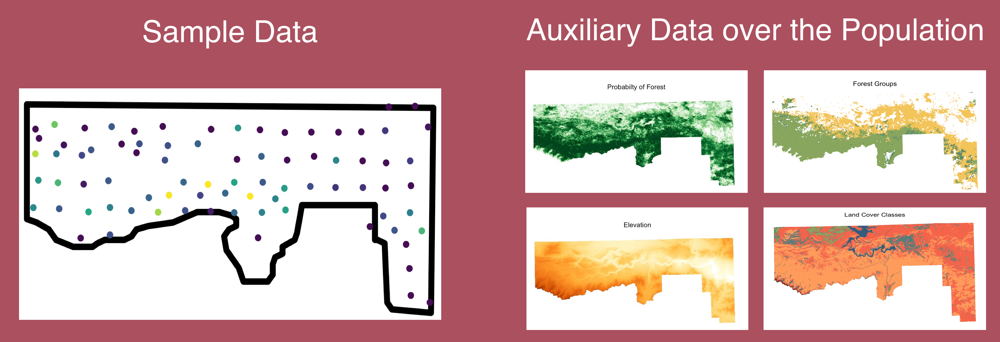
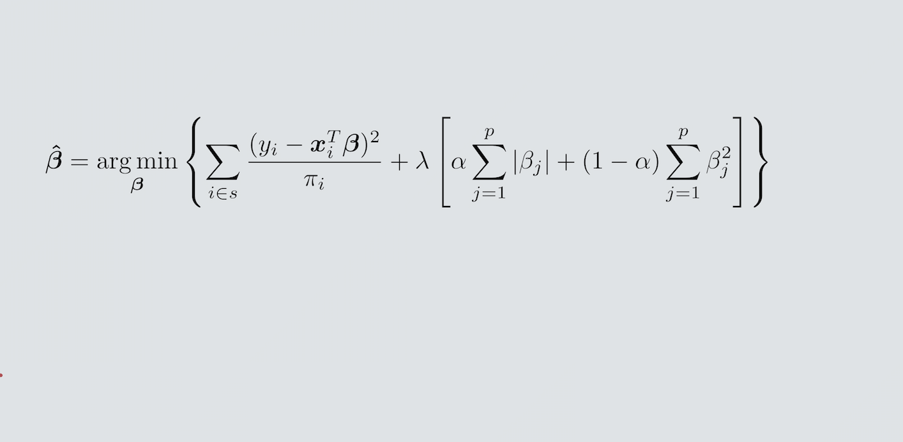
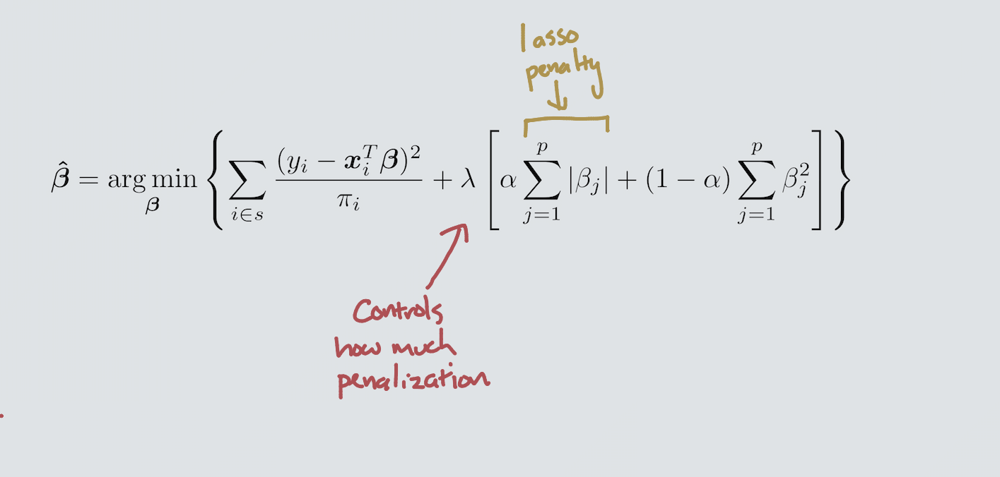
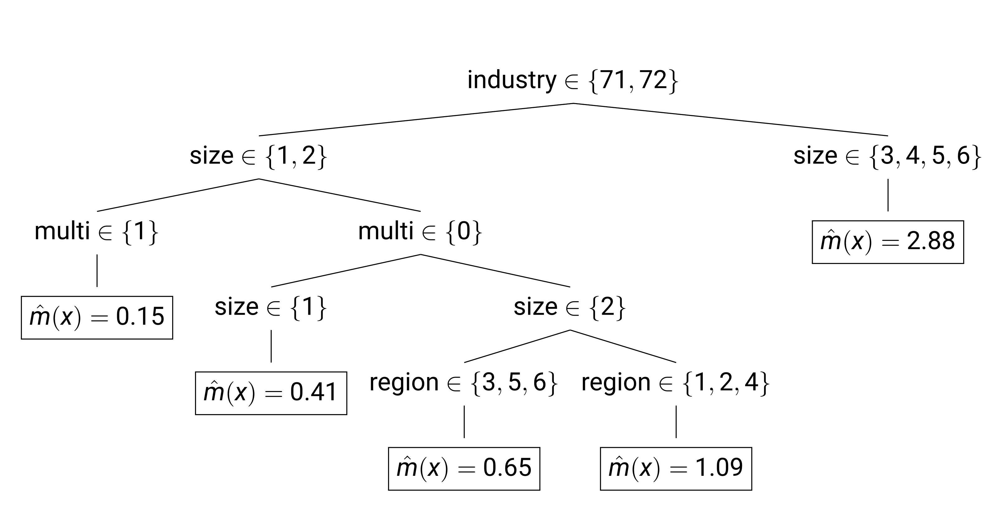

```{r setup, include=FALSE}
knitr::opts_chunk$set(echo = TRUE, message = FALSE, 
                      warning = FALSE, fig.width = 6,
                      fig.height = 4,
                      fig.retina = 3)

options(digits=2, scipen = 3)

# Fix how htmlwidgets are rendered 
# https://stackoverflow.com/questions/65766516/xaringan-presentation-not-displaying-html-widgets-even-when-knitting-provided-t
options(htmltools.preserve.raw = FALSE)
library(knitr)
options(knitr.table.format = "html")
library(tidyverse)
```


class: center, middle, hide_logo
background-image: url("img/casestudies.jpeg")
background-position: left
background-size: contain
background-color: #e9ecef


.pull-right[

## Case Studies


#### A Data Science Approach to Official Statistics Estimation: Leveraging the Power of Machine Learning Models

#### 2021 International Methodology Symposium

#### Kelly McConville

#### October 14, 2021

]


---

class: center

```{r, echo = FALSE, out.width= "15%", out.extra='style="float:left; padding:10px"'}
knitr::include_graphics("img/fs.png")
```

###  Case Study 1: [US Forest Inventory and Analysis Program](https://www.fia.fs.fed.us/about/about_us/)

> **Mission**: "Make and keep current a comprehensive inventory and analysis of the present and prospective conditions of and requirements for the renewable resources of the forest and rangelands of the US."


Focusing on Daggett County, Utah:

```{r, echo = FALSE}

```

.pull-left[

Quasi-systematic sample of ground plots

]


.pull-right[

**Many** layers of remotely sensed data!

]

---


```{r, echo = FALSE, out.width= "15%", out.extra='style="float:left; padding:10px"'}
knitr::include_graphics("img/fs.png")
```

###  Case Study 1: [US Forest Inventory and Analysis Program](https://www.fia.fs.fed.us/about/about_us/)

**Goal**: Estimate .orange2[MANY] finite population quantities!

--

* Want a simple model.
--

* Have lots of auxiliary data layers.

```{r, echo = FALSE}
knitr::include_graphics("img/FIA_EDA.jpeg")
```


<!-- ###  Case Study 1: [US Forest Inventory and Analysis Program](https://www.fia.fs.fed.us/about/about_us/) -->

<!-- **Goal**: Estimate .orange2[MANY] finite population quantities! -->


<!-- Use linear assisting model but estimate coefficients with the .orange2[elastic net]: -->


<!-- \begin{aligned} -->
<!-- \boldsymbol{\hat{\beta}} &= \underset{\boldsymbol{\beta}}{\arg\min}  \left\{ \sum_{i \in s} \frac{(y_i - \boldsymbol{x}_i^T \boldsymbol{\beta})^2}{ \pi_i} + \lambda \left[ \alpha \sum_{j=1}^p \left|\beta_j\right| + (1-\alpha) \sum_{j=1}^p \beta_j^2\right] \right\} -->
<!-- \end{aligned} -->

---

```{r, echo = FALSE, out.width= "15%", out.extra='style="float:left; padding:10px"'}
knitr::include_graphics("img/fs.png")
```


###  Case Study 1: [US Forest Inventory and Analysis Program](https://www.fia.fs.fed.us/about/about_us/)

**Goal**: Estimate .orange2[MANY] finite population quantities!

Use linear assisting model but estimate coefficients with the .orange2[elastic net]:


```{r, echo = FALSE, out.width = '80%'}

```


---

```{r, echo = FALSE, out.width= "15%", out.extra='style="float:left; padding:10px"'}
knitr::include_graphics("img/fs.png")
```


###  Case Study 1: [US Forest Inventory and Analysis Program](https://www.fia.fs.fed.us/about/about_us/)

**Goal**: Estimate .orange2[MANY] finite population quantities!

Use linear assisting model but estimate coefficients with the .orange2[elastic net]:


```{r, echo = FALSE, out.width = '80%'}
knitr::include_graphics("img/penalty.png")
```

---

```{r, echo = FALSE, out.width= "15%", out.extra='style="float:left; padding:10px"'}
knitr::include_graphics("img/fs.png")
```


###  Case Study 1: [US Forest Inventory and Analysis Program](https://www.fia.fs.fed.us/about/about_us/)

**Goal**: Estimate .orange2[MANY] finite population quantities!

Use linear assisting model but estimate coefficients with the .orange2[elastic net]:


```{r, echo = FALSE, out.width = '80%'}

```

---

```{r, echo = FALSE, out.width= "15%", out.extra='style="float:left; padding:10px"'}
knitr::include_graphics("img/fs.png")
```


###  Case Study 1: [US Forest Inventory and Analysis Program](https://www.fia.fs.fed.us/about/about_us/)

**Goal**: Estimate .orange2[MANY] finite population quantities!

Use linear assisting model but estimate coefficients with the .orange2[elastic net]:


```{r, echo = FALSE, out.width = '80%'}
knitr::include_graphics("img/ridge.png")
```

---

```{r, echo = FALSE, out.width= "15%", out.extra='style="float:left; padding:10px"'}
knitr::include_graphics("img/fs.png")
```


###  Case Study 1: [US Forest Inventory and Analysis Program](https://www.fia.fs.fed.us/about/about_us/)

**Goal**: Estimate .orange2[MANY] finite population quantities!

Use linear assisting model but estimate coefficients with the .orange2[elastic net]:


```{r, echo = FALSE, out.width = '80%'}
knitr::include_graphics("img/alpha.png")
```


---


```{r, echo = FALSE, out.width= "15%", out.extra='style="float:left; padding:10px"'}
knitr::include_graphics("img/fs.png")
```

###  Case Study 1: [US Forest Inventory and Analysis Program](https://www.fia.fs.fed.us/about/about_us/)

**Goal**: Estimate .orange2[MANY] finite population quantities!

--

.center[**For total trees per acre**]

--

.pull-left[

**Selected Predictors**:

* Normalized Difference Vegetation Index
* Slope
* Normalized Burn Ratio
* Elevation
* Slope : Forest/Non-Forest


]

--

.pull-right[

**Non-Selected Predictors**:

* Forest Probability
* Eastness
* Forest Probability : Forest/Non-Forest
* Normalized Difference Vegetation Index : Forest/Non-Forest
* Normalized Burn Ratio : Forest/Non-Forest
* Elevation : Forest/Non-Forest
* Eastness : Forest/Non-Forest


]


---

class: center

```{r, echo = FALSE, out.width= "15%", out.extra='style="float:left; padding:10px"'}
knitr::include_graphics("img/fs.png")
```

###  Case Study 1: [US Forest Inventory and Analysis Program](https://www.fia.fs.fed.us/about/about_us/)

**Goal**: Estimate .orange2[MANY] finite population quantities!

```{r, echo = FALSE}
dat <- data.frame(name = c("Horvitz-Thompson", "FIA", "Elastic Net"),
                  value = c(327.76,
                            336.35,
                            316.55), 
                  se = c(58.44, 55.82,
                         43.9)) %>%
  mutate(name = factor(name),
         name = forcats::fct_relevel(name, "Horvitz-Thompson", "FIA"))
dat %>%
ggplot(mapping = aes(x = name, y = value))   +
  theme_bw() +
  geom_errorbar(aes(ymin = value - 2*se, ymax = value + 2*se), width = 0.2, color = "#AB505E", size = 2) + 
  geom_point(size = 5, color = "orange") +
  labs(x = "Estimator",
       y = "Average Trees per Acre",
       title = "Daggett County Utah Estimates of Average Trees per Acre")
```


---


```{r, echo = FALSE, out.width= "15%", out.extra='style="float:left; padding:10px"'}
knitr::include_graphics("img/bls2.png")
```


### Case Study 2: [US Bureau of Labor Statistics](https://www.bls.gov/bls/blsmissn.htm)

> **Mission**: "Measures labor market activity, working conditions, price changes, and productivity in the U.S. economy to support public and private decision making."

**Goal**: Estimate the total number of certain job types.


.pull-left[


Complex survey data from the BLS Occupational Employment Statistics Survey


]


.pull-right[

Quarterly Census of Employment and Wages:

* Size class

* Geographic information

* Industry type

* Whether or not its a multi-establishment firm

]


---


```{r, echo = FALSE, out.width= "15%", out.extra='style="float:left; padding:10px"'}
knitr::include_graphics("img/bls2.png")
```


### Case Study 2: [US Bureau of Labor Statistics](https://www.bls.gov/bls/blsmissn.htm)

> **Mission**: "Measures labor market activity, working conditions, price changes, and productivity in the U.S. economy to support public and private decision making."

**Goal**: Estimate the total number of certain job types.


--

.orange2[What assisting model should we use?]


---


```{r, echo = FALSE, out.width= "15%", out.extra='style="float:left; padding:10px"'}
knitr::include_graphics("img/bls2.png")
```


### Case Study 2: [US Bureau of Labor Statistics](https://www.bls.gov/bls/blsmissn.htm)

> **Mission**: "Measures labor market activity, working conditions, price changes, and productivity in the U.S. economy to support public and private decision making."

**Goal**: Estimate the total number of certain job types.


.orange2[Why should we not use linear regression?]

--

* We have mostly categorical variables with many categories.

--

* The industry code is likely important and most job types probably only fall into a few of the industries.

--

* Additive model is too simple and the fully interactive is too complex with not enough data in many sub-groups.


---


```{r, echo = FALSE, out.width= "15%", out.extra='style="float:left; padding:10px"'}
knitr::include_graphics("img/bls2.png")
```


### Case Study 2: [US Bureau of Labor Statistics](https://www.bls.gov/bls/blsmissn.htm)

> **Mission**: "Measures labor market activity, working conditions, price changes, and productivity in the U.S. economy to support public and private decision making."

Use regression trees instead!


```{r, echo = FALSE, out.width= "50%", fig.align='center'}
knitr::include_graphics("img/trees.001.jpeg")
```

* Recursively split sample into two groups based on an auxiliary variable.

* Industry has 24 categories.
    + Industry #71:  Arts, Entertainment, and Recreation
    + Industry #72:  Accommodation and Food Services


---


```{r, echo = FALSE, out.width= "15%", out.extra='style="float:left; padding:10px"'}
knitr::include_graphics("img/bls2.png")
```


### Case Study 2: [US Bureau of Labor Statistics](https://www.bls.gov/bls/blsmissn.htm)

> **Mission**: "Measures labor market activity, working conditions, price changes, and productivity in the U.S. economy to support public and private decision making."


```{r, echo = FALSE, out.width= "60%", fig.align='center'}
knitr::include_graphics("img/trees.002.jpeg")
```

* .orange2[Recursively] split sample into two groups based on an auxiliary variable.


---


```{r, echo = FALSE, out.width= "15%", out.extra='style="float:left; padding:10px"'}
knitr::include_graphics("img/bls2.png")
```


### Case Study 2: [US Bureau of Labor Statistics](https://www.bls.gov/bls/blsmissn.htm)

> **Mission**: "Measures labor market activity, working conditions, price changes, and productivity in the U.S. economy to support public and private decision making."


```{r, echo = FALSE, out.width= "100%", fig.align='center'}
knitr::include_graphics("img/trees.004.jpeg")
```

* .orange2[Recursively] split sample into two groups based on an auxiliary variable.


---


```{r, echo = FALSE, out.width= "15%", out.extra='style="float:left; padding:10px"'}
knitr::include_graphics("img/bls2.png")
```


### Case Study 2: [US Bureau of Labor Statistics](https://www.bls.gov/bls/blsmissn.htm)

> **Mission**: "Measures labor market activity, working conditions, price changes, and productivity in the U.S. economy to support public and private decision making."


```{r, echo = FALSE, out.width= "60%", fig.align='center'}

```

At each end node, the estimator is given by the .orange2[survey-weighted mean].

---

### The Regression Tree Estimator

$$\hat{t}_y = \sum_{i \in U} \hat{m}(\boldsymbol{x_i}) + \sum_{i \in s} \frac{y_i - \hat{m}(\boldsymbol{x_i})}{\pi_i}$$

Let $Q = \{ B_{1}, B_{2}, \ldots, B_{q} \}$ be the of partitioning boxes from the tree.

--

For $\boldsymbol{x} \in B_k$:

\begin{align*}
    \hat{m}({\boldsymbol x})=
   \widehat{\#}(B_{k})^{-1} \sum_{i \in s} \pi_{i}^{-1} y_i I ({\boldsymbol x}_i \in B_{k})
\end{align*}

where

\begin{align*}
   \widehat{\#}(B_{k}) = \sum_{i \in s} \pi_{i}^{-1} I ({\boldsymbol x}_i \in B_{k}).
\end{align*}

---

### The Regression Tree Estimator

* Splits are selected based on a permutation test.

* Tree stops splitting based on a p-value threshold or minimum end node size.

* R package for regression trees built on complex survey data: [rpms](https://cran.r-project.org/web/packages/rpms/index.html)
    + Written by [Daniell Toth](https://scholar.google.com/citations?user=1lUPZikAAAAJ)

---

### The Regression Tree Estimator

#### Calibration

Can linearize the trees:

$$\hat{m}({\bf x}) = \tilde{\mu}_{n1}  I({\bf x} \in B_{n1}) + \tilde{\mu}_{n2} I({\bf x} \in B_{n2}) + \ldots + \tilde{\mu}_{nq}  I({\bf x} \in B_{nq})$$

--


* Regression tree is .orange2[calibrated] to population totals of the end nodes:

$$\sum_{j \in U} I({ \bf x}_j \in B_{nk}) =   \sum_{j \in s} \tilde{w}_j I({ \bf x}_j \in B_{nk})$$


----   

--


#### Post-stratification

* Post-stratified estimator: Generalized regression estimator where the assisting model is the group mean model

--

* Regression tree estimator: End nodes of the tree are a set of .orange2[predictive] post-strata!

---

### Case Study 2: [US Bureau of Labor Statistics](https://www.bls.gov/bls/blsmissn.htm)

> **Mission**: "Measures labor market activity, working conditions, price changes, and productivity in the U.S. economy to support public and private decision making."

**Goal**: Estimate the total number of certain job types.

```{r, echo = FALSE, out.width='90%', fig.pos='center'}
knitr::include_graphics("img/bls_results.001.jpeg")
```

---

class: center, middle
background-color: #CFF09E

### General Thoughts on Selecting the Model

--

#### Consider your audience.

--

#### Figure out what data you have access to.

--

#### Do lots of exploratory data analysis.

--


#### Analyze the resulting survey weights.


---

class: center, middle
background-color: #CFF09E

## Questions?
