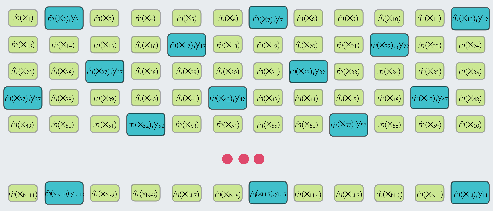

```{r setup, include=FALSE}
knitr::opts_chunk$set(echo = TRUE, message = FALSE, 
                      warning = FALSE, fig.width = 6,
                      fig.height = 4,
                      fig.retina = 3)

options(digits=2, scipen = 3)

# Fix how htmlwidgets are rendered 
# https://stackoverflow.com/questions/65766516/xaringan-presentation-not-displaying-html-widgets-even-when-knitting-provided-t
options(htmltools.preserve.raw = FALSE)
library(knitr)
options(knitr.table.format = "html")
library(tidyverse)
```


class: center, middle, hide_logo
background-image: url("img/louis-philippe-poitras-W-vPMF3vUK0-unsplash.jpg")
background-position: left
background-size: contain
background-color: #e9ecef


<style>
.mauve {color: #AB505E;}
.red {color: #FF0000;}
.green {color: #00FF00;}
.blue {color: #0000FF;}
</style>

<!-- Cite: https://unsplash.com/photos/W-vPMF3vUK0 -->


<!-- Add new picture: Equations! -->


.pull-right[

## Deep Dive into the Generalized Regression Estimator


#### A Data Science Approach to Official Statistics Estimation: Leveraging the Power of Machine Learning Models

#### 2021 International Methodology Symposium

#### Kelly McConville

#### October 14, 2021

]


---

class: center

### Model-Assisted Survey Estimation


#### **Goal**: Estimate finite population quantities, such as means and totals.


#### Data Needed:


```{r, echo = FALSE}
knitr::include_graphics("img/data_needs2.004.jpeg")
```

---

class: center

### Model-Assisted Estimator

Generalized Regression Estimator: 

$$\hat{t}_y = \sum_{i \in U} \hat{m}(\boldsymbol{x_i}) + \sum_{i \in s} \frac{y_i - \hat{m}(\boldsymbol{x_i})}{\pi_i}$$


```{r, echo = FALSE}
knitr::include_graphics("img/all_data.jpeg")
```


---

class: center, middle
background-color: #CFF09E

### But what about the statistical properties of the estimator?

--

### And the form of the assisting model $\hat{m}(\cdot)$? 

--

### Is the estimator unbiased?

--

### How should we estimate the variance?

---

class: center

### Difference Estimator


Suppose we had a "method" for predicting $y$, $m(\cdot)$, that does not depend on the sample.

```{r, echo = FALSE}
knitr::include_graphics("img/all_data.jpeg")
```

--

$$\hat{t}_y = \sum_{i \in U} m(\boldsymbol{x_i}) + \sum_{i \in s} \frac{y_i - m(\boldsymbol{x_i})}{\pi_i}$$

---

### Difference Estimator


$$\hat{t}_y = \sum_{i \in U} m(\boldsymbol{x_i}) + \sum_{i \in s} \frac{y_i - m(\boldsymbol{x_i})}{\pi_i}$$


--

Is design unbiased: $E(\hat{t}_y) = t_y$

--

Has a simple variance equation:

$$\mbox{V}\left(\hat{t}_y\right) = \underset{i, j \in U}{\sum \sum} (\pi_{ij} - \pi_i \pi_j) \frac{\left(y_i - m(\boldsymbol{x}_i)\right)}{\pi_i}\frac{\left(y_j - m(\boldsymbol{x}_j)\right)}{\pi_j}$$

where $\pi_{ij} = P(i, j \in s)$.


--

Which has a design unbiased estimator:

$$\hat{\mbox{V}}\left(\hat{t}_y\right) = \underset{i, j \in s}{\sum \sum} \frac{(\pi_{ij} - \pi_i \pi_j)}{\pi_{ij}} \frac{\left(y_i - m(\boldsymbol{x}_i)\right)}{\pi_i}\frac{\left(y_j - m(\boldsymbol{x}_j)\right)}{\pi_j}$$

<!-- Discuss difference estimator and its variance estimator. Unbiased. -->

<!-- Motivation for variance estimator of the generalized regression estimator. -->

<!-- Provide usual formula.  Caveats.  Bootstrap. -->

---

### Difference Estimator


$$\hat{t}_y = \sum_{i \in U} m(\boldsymbol{x_i}) + \sum_{i \in s} \frac{y_i - m(\boldsymbol{x_i})}{\pi_i}$$


And, even better, under mild conditions, it is asymptotically normal!

--


```{r, echo = FALSE, fig.align='center'}
library(tidyverse)
library(gganimate)
colours <- c(
  'lawngreen',
  'gold',
  'white',
  'orchid',
  'royalblue',
  'yellow',
  'orange'
)
# Produce data for a single blast
blast <- function(n, radius, x0, y0, time) {
  u <- runif(n, -1, 1)
  rho <- runif(n, 0, 2*pi)
  x <- radius * sqrt(1 - u^2) * cos(rho) + x0
  y <- radius * sqrt(1 - u^2) * sin(rho) + y0
  id <- sample(.Machine$integer.max, n + 1)
  data.frame(
    x = c(x0, rep(x0, n), x0, x),
    y = c(0, rep(y0, n), y0, y),
    id = rep(id, 2),
    time = c((time - y0) * runif(1), rep(time, n), time, time + radius + rnorm(n)),
    colour = c('white', rep(sample(colours, 1), n), 'white', rep(sample(colours, 1), n)),
    stringsAsFactors = FALSE
  )
}
# Make 20 blasts
n <- round(rnorm(20, 30, 4))
radius <- round(n + sqrt(n))
x0 <- runif(20, -30, 30)
y0 <- runif(20, 40, 80)
time <- runif(20, max = 100)
fireworks <- Map(blast, n = n, radius = radius, x0 = x0, y0 = y0, time = time)
fireworks <- dplyr::bind_rows(fireworks)
p <- ggplot(fireworks) + 
  geom_point(aes(x, y, colour = colour, group = id), size = 0.5, shape = 20) + 
  scale_colour_identity() + 
  coord_fixed(xlim = c(-65, 65), expand = FALSE, clip = 'off') +
  theme_void() + 
  theme(plot.background = element_rect(fill = 'black', colour = NA), 
        panel.border = element_blank()) + 
  # Here comes the gganimate code
  transition_components(time, exit_length = 20) + 
  ease_aes(x = 'sine-out', y = 'sine-out') + 
  shadow_wake(0.05, size = 3, alpha = TRUE, wrap = FALSE, 
              falloff = 'sine-in', exclude_phase = 'enter') + 
  exit_recolour(colour = 'black')


animate(p, width = 500, height = 300)
```

---

### Difference Estimator


$$\hat{t}_y = \sum_{i \in U} m(\boldsymbol{x_i}) + \sum_{i \in s} \frac{y_i - m(\boldsymbol{x_i})}{\pi_i}$$


But, we rarely have a known $m(\cdot)$ and must therefore estimate it based on the sample: $\hat{m}(\cdot)$, resulting in...

--

### Generalized Regression Estimator


$$\hat{t}_y = \sum_{i \in U} \hat{m}(\boldsymbol{x_i}) + \sum_{i \in s} \frac{y_i - \hat{m}(\boldsymbol{x_i})}{\pi_i}$$

---

### The Generalized Regression Estimator


$$\hat{t}_y = \sum_{i \in U} \hat{m}(\boldsymbol{x_i}) + \sum_{i \in s} \frac{y_i - \hat{m}(\boldsymbol{x_i})}{\pi_i}$$
with assisting model:

$$
y = m(\boldsymbol{x}) + \epsilon
$$

```{r, echo = FALSE}

```


---

### The Generalized Regression Estimator


$$\hat{t}_y = \sum_{i \in U} \hat{m}(\boldsymbol{x_i}) + \sum_{i \in s} \frac{y_i - \hat{m}(\boldsymbol{x_i})}{\pi_i}$$

--

Also goes by .mauve[The Empirical Difference Estimator] and .mauve[The Model-Assisted Estimator]

--

Is .mauve[asymptotically] unbiased: $E(\hat{t}_y) \rightarrow t_y$

--

Doesn't have an exact design variance expression

--

Estimated variance based on formula from the Difference Estimator:

$$\hat{\mbox{V}}\left(\hat{t}_y\right) = \underset{i, j \in s}{\sum \sum} \frac{(\pi_{ij} - \pi_i \pi_j)}{\pi_{ij}} \frac{\left(y_i - \hat{m}(\boldsymbol{x}_i)\right)}{\pi_i}\frac{\left(y_j - \hat{m}(\boldsymbol{x}_j)\right)}{\pi_j}$$
---

### The Assisting Model

Many assisting models have been considered!

--

An incomplete list includes:

* Linear Regression (Cassel, Sarndal, and Wretman 1976)

* Logistic Regression (Lehtonen and Veijanen 1998)

* Local polynomial regression (Breidt and Opsomer 2000; Montanari and Ranalli 2005)

* Penalized Splines (Breidt, Claeskens, and Opsomer 2005; McConville and Breidt 2013)

* Regression Splines (Goga 2005)

* Neural Networks (Montanari and Ranalli 2005)

* LASSO/Penalized Regression (McConville et al 2017)

* Regression Trees (McConville and Toth 2020)

---

### The Assisting Model

How should I pick which assisting model to use?

--

Remember that the model-assisted estimator is asymptotically unbiased 

--

* For a wide range of assisting models

--

* Regardless of whether or not the assisting model is correct

--

BUT the .mauve[precision] of the estimator depends on the predictive quality of model!


$$\hat{\mbox{V}}\left(\hat{t}_y\right) = \underset{i, j \in s}{\sum \sum} \frac{(\pi_{ij} - \pi_i \pi_j)}{\pi_{ij}} \frac{\left(y_i - \hat{m}(\boldsymbol{x}_i)\right)}{\pi_i}\frac{\left(y_j - \hat{m}(\boldsymbol{x}_j)\right)}{\pi_j}$$
---

class: center, middle
background-color: #CFF09E

# Up Next: 

--

### Come back to the FIA and BLS case studies and consider suitable assisting models

--

### Practice fitting generalized regression estimators in `R`!

---

class: center, middle
background-color: #CFF09E

# Questions?

<!-- --- -->

<!-- Next slide deck: -->

<!-- Pull from `mase` demo + more discussion of the model checking step! -->