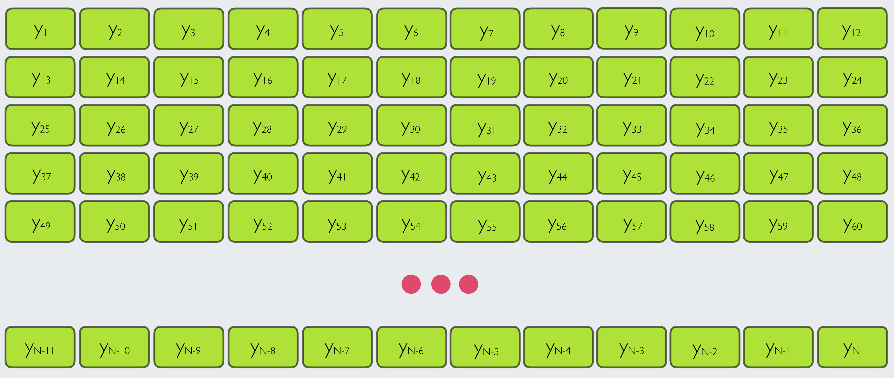
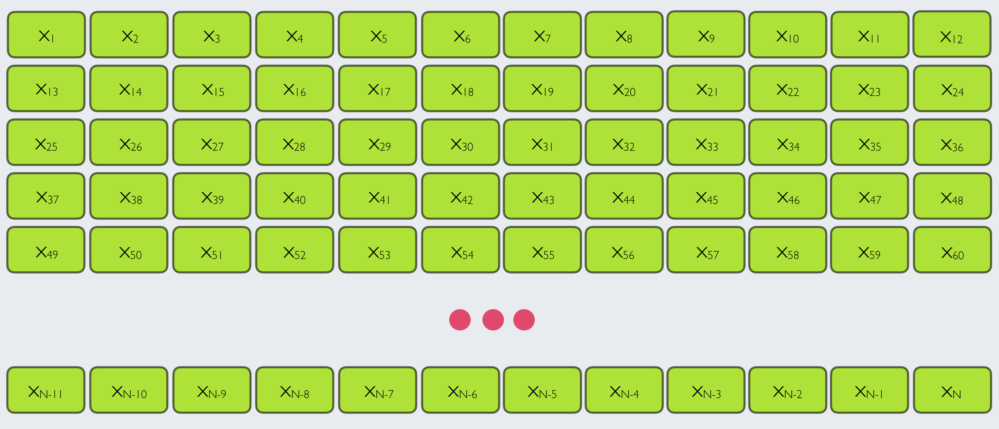

```{r setup, include=FALSE}
knitr::opts_chunk$set(echo = TRUE, message = FALSE, 
                      warning = FALSE, fig.width = 6,
                      fig.height = 4,
                      fig.retina = 3)

options(digits=2, scipen = 3)

# Fix how htmlwidgets are rendered 
# https://stackoverflow.com/questions/65766516/xaringan-presentation-not-displaying-html-widgets-even-when-knitting-provided-t
options(htmltools.preserve.raw = FALSE)
library(knitr)
options(knitr.table.format = "html")
library(tidyverse)
```


class: center, middle, hide_logo
background-image: url("img/daggett6.001.jpeg")
background-position: left
background-size: contain
background-color: #e9ecef


.pull-right[

## Model-Assisted Estimation


#### A Data Science Approach to Official Statistics Estimation: Leveraging the Power of Machine Learning Models

#### 2021 International Methodology Symposium

#### Kelly McConville

#### October 14, 2021

]


---

class: center

### Model-Assisted Survey Estimation

--

#### **Goal**: Estimate finite population quantities, such as means and totals.

--

#### Data Needed:


```{r, echo = FALSE}
knitr::include_graphics("img/data_needs2.004.jpeg")
```

---

class: center

### Estimation Set-up

--

Enumerate the finite population of interest.

```{r, echo = FALSE}
knitr::include_graphics("img/enumerate.jpeg")
```

$U = \{1, 2, \ldots, N\}$


---

class: center

### Estimation Set-up

--


**Goal:** Estimate a population quantity, such as the total of a response variable, $y$.


```{r, echo = FALSE}

```


$t_y = \sum_{i \in U} y_i$


---

class: center

### Estimation Set-up

--


Have auxiliary data for the entire population or summary auxiliary data.


```{r, echo = FALSE}

```


Have $\{\boldsymbol{x}_i\}_{i\in U}$ or $\bar{\boldsymbol{x}}_U$.


---

class: center

### Estimation Set-up

--


Construct a sampling design.  Assume a design-based approach to inference.

```{r, echo = FALSE}
knitr::include_graphics("img/sampling_design.jpeg")
```


Have $\{\pi_i\}_{i\in U}$ where $\pi_i = P(i \in s)$.


---

class: center

### Estimation Set-up

A sample is taken and you have access to the following data for estimation.

```{r, echo = FALSE}
knitr::include_graphics("img/all_data.jpeg")
```

--

One option: $\hat{t}_y = \sum_{i \in s} \frac{y_i}{\pi_i}$

(Horvitz-Thompson Estimator)


---

class: center

### Estimation Set-up

Another option: Use the sample to .orange2[**build**] a model and then .orange2[**predict**] $y$ over all the population units.

```{r, echo = FALSE}
knitr::include_graphics("img/model_fits.jpeg")
```

$\hat{t}_y = \sum_{i \in s} y_i + \sum_{i \in U-s} \hat{m}(\boldsymbol{x_i})$

---

class: center

### Estimation Set-up

Estimator: $\hat{t}_y = \sum_{i \in s} y_i + \sum_{i \in U-s} \hat{m}(\boldsymbol{x_i})$

```{r, echo = FALSE}
knitr::include_graphics("img/model_fits.jpeg")
```

Estimator can be rather .orange2[biased] when the model is misspecified.


---

class: center

### Estimation Set-up

**Another approach:** Use a bias-correction term.

```{r, echo = FALSE}
knitr::include_graphics("img/model_fits.jpeg")
```


Model-assisted estimator: 

$$\hat{t}_y = \sum_{i \in U} \hat{m}(\boldsymbol{x_i}) + \sum_{i \in s} \frac{y_i - \hat{m}(\boldsymbol{x_i})}{\pi_i}$$


---

class: center, middle
background-color: #CFF09E

### Come back to the specifics of the estimator soon...

--

## But first, do we even have the necessary data?

---

class: center

```{r, echo = FALSE, out.width= "15%", out.extra='style="float:left; padding:10px"'}
knitr::include_graphics("img/fs.png")
```

###  Case Study 1: [US Forest Inventory and Analysis Program](https://www.fia.fs.fed.us/about/about_us/)

> **Mission**: "Make and keep current a comprehensive inventory and analysis of the present and prospective conditions of and requirements for the renewable resources of the forest and rangelands of the US."


--

Focusing on Daggett County, Utah:

```{r, echo = FALSE}
knitr::include_graphics("img/data_needs2.004.jpeg")
```

.pull-left[

Quasi-systematic sample of ground plots

]

--

.pull-right[

**Many** layers of remotely sensed data!

]

---


```{r, echo = FALSE, out.width= "15%", out.extra='style="float:left; padding:10px"'}
knitr::include_graphics("img/bls2.png")
```


### Case Study 2: [US Bureau of Labor Statistics](https://www.bls.gov/bls/blsmissn.htm)

> **Mission**: "Measures labor market activity, working conditions, price changes, and productivity in the U.S. economy to support public and private decision making."

.pull-left[


Maintain many different surveys:

* Job Openings and Labor Turnover Survey
* Occupational Employment and Wage Statistics


]

--

.pull-right[

Quarterly Census of Employment and Wages:

* Size class

* Geographic information

* Industry type

* Whether or not its a multi-establishment firm

]


---

class: center, middle
background-color: #CFF09E


## In your breakout rooms, each person should discuss:

--

### The survey data you have access to.

--

### The auxiliary data you have access to.

--

### If you are currently combining these data sources for estimation.

<!-- --- -->

<!-- ## Other case studies... -->

<!-- -- -->

<!-- ```{r, echo = FALSE, out.width= "15%", out.extra='style="float:left; padding:10px"'} -->
<!-- knitr::include_graphics("img/fs.png") -->
<!-- ``` -->

<!-- ### [American Community Survey using Age and Sex for Census Tracts](https://www.census.gov/content/dam/Census/library/working-papers/2007/acs/2007_Fay_01.pdf) -->


<!-- XXX: Find more! -->


