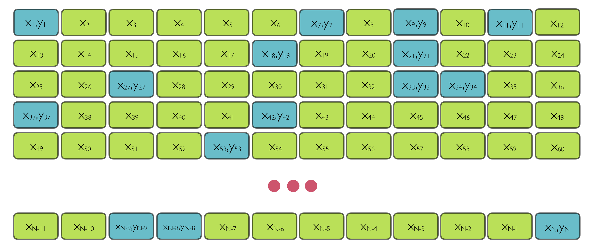

```{r setup, include=FALSE}
knitr::opts_chunk$set(echo = TRUE, message = FALSE, 
                      warning = FALSE, fig.width = 6,
                      fig.height = 4,
                      fig.retina = 3,
                      cache = TRUE)

options(digits=2, scipen = 3)

# Fix how htmlwidgets are rendered 
# https://stackoverflow.com/questions/65766516/xaringan-presentation-not-displaying-html-widgets-even-when-knitting-provided-t
options(htmltools.preserve.raw = FALSE)
library(knitr)
options(knitr.table.format = "html")
library(tidyverse)
```


class: center, middle, hide_logo
background-image: url("img/mases.001.png")
background-position: left
background-size: contain
background-color: #e9ecef


.pull-right[

## Applications in `R` with `mase`

#### A Data Science Approach to Official Statistics Estimation: Leveraging the Power of Machine Learning Models

#### 2021 International Methodology Symposium

#### Kelly McConville

#### October 14, 2021

]


---


## Model-Assisted Survey Estimation

**Goal**: Estimate $t_y = \sum_{i \in U} y_i$.


Data we have:

```{r, echo = FALSE}

```

* Along with first-order inclusion probabilities


---

background-image: url("img/mases.001.png")
background-position: left
background-size: contain


.pull-right[

## Documentation

* [CRAN](https://cran.r-project.org/web/packages/mase/)

```{r, eval = FALSE}
install.packages("mase")
```


* Very Developmental Version:  [GitHub](https://github.com/mcconvil/mase)
    + Recommend installing the CRAN version


]


---

## Estimators in mase


$$\hat{t}_y = \sum_{i \in U} \hat{m}(x_i) + \sum_{i \in s} \frac{y_i - \hat{m}(x_i)}{\pi_i}$$

Where $m(\cdot)$ is:

* Linear regression through the origin: `ratioEstimator()`
* Linear regression: `greg()` (Generalized Regression Estimator)
* Elastic-Net regression: `gregElasticNet()`
* Regression trees: `gregTree()`
    + Uses `rpms`


---

## Example Dataset: `pdxTrees`

.left-column[

```{r, echo = FALSE}

```

]

.right-column[

`r emo::ji("deciduous_tree")` Data from Portland, OR Tree Inventory Project

`r emo::ji("deciduous_tree")` [Vignette](https://cran.r-project.org/web/packages/pdxTrees/vignettes/pdxTrees-vignette.html)

`r emo::ji("deciduous_tree")` [CRAN](https://cran.r-project.org/web/packages/pdxTrees/)

`r emo::ji("deciduous_tree")` [GitHub](https://github.com/mcconvil/pdxTrees)


```{r, message = FALSE, warning = FALSE}
library(tidyverse)
library(pdxTrees)
pop <- get_pdxTrees_parks() %>%
  replace_na(list(Functional_Type = "Unknown")) %>%
  drop_na(DBH, Tree_Height, Condition,
          Functional_Type)
nrow(pop)
```

]


---

## Example Dataset: `pdxTrees`

**Want to estimate the average diameter at breast height**

* Y = `DBH`

* Auxiliary data: X = `Tree_Height`, `Condition`, `Functional_Type`
    + Known for every tree in the population

```{r}
set.seed(44)
samp_SRS <- sample_n(pop, 1000) %>%
  select(DBH, Tree_Height, Condition, Functional_Type) %>%
  mutate(pi = 1000/nrow(pop))
```

---

## Exploratory Data Analysis

```{r}
ggplot(data = samp_SRS, 
       mapping = aes(x = Tree_Height, 
                     y = DBH, 
                     color = Condition,
                     size = 1/pi)) +
  geom_point(alpha = 0.2) +
  geom_smooth(method = "lm", se = FALSE)
```

---

## Exploratory Data Analysis


```{r}
ggplot(data = samp_SRS, 
       mapping = aes(x = Condition, 
                     y = DBH, 
                     fill = Condition)) +
  geom_boxplot() +
  guides(fill = FALSE)
```

---

## Exploratory Data Analysis


```{r}
ggplot(data = samp_SRS, 
       mapping = aes(x = Functional_Type, 
                     y = DBH, 
                     fill = Functional_Type)) +
  geom_boxplot() +
  guides(fill = FALSE)
```

---

### Horvitz-Thompson Estimator

```{r}
library(mase)

horvitzThompson(y = samp_SRS$DBH,
          pi = samp_SRS$pi, var_est = TRUE)
```

---

### Generalized Regression Estimator

```{r}
xsample <- select(samp_SRS, Condition, Tree_Height) %>%
  as.data.frame()

xpop <- select(pop, names(xsample))

greg(y = samp_SRS$DBH, xsample = xsample, xpop = xpop,
          pi = samp_SRS$pi, var_est = TRUE, datatype = "raw")
```


---

### Generalized Regression Estimator with Elastic Net

```{r}
gregElasticNet(y = samp_SRS$DBH, xsample = xsample, xpop = xpop,
          pi = samp_SRS$pi, var_est = TRUE, datatype = "raw")
```

---

### Generalized Regression Estimator with Regression Trees

```{r}
xsample <- select(samp_SRS, Functional_Type, Tree_Height) %>%
  mutate(Functional_Type = factor(Functional_Type)) %>%
  as.data.frame() 

xpop <- select(pop, names(xsample)) %>%
  mutate(Functional_Type = factor(Functional_Type)) %>%
  as.data.frame()

est <- gregTree(y = samp_SRS$DBH, xsample = xsample, 
                xpop = xpop, pi = samp_SRS$pi)
```

---

### Generalized Regression Estimator with Regression Trees


```{r}
est$tree
```


---

### Aggregated Auxiliary Information

* Don't have unit level data for the non-sampled units
* Just have aggregated data

```{r, echo = FALSE}
library(recipes)

xpop <- select(pop, Condition, Tree_Height)

xpop_agg <- recipe(~ Condition + Tree_Height, data = xpop) %>%
  step_dummy(Condition) %>%
  prep(training = xpop) %>%
  bake(new_data = NULL) %>%
  summarise_all(mean)
```

```{r}
xpop_agg
```


```{r}
library(recipes)

xsample <- recipe(~ Condition + Tree_Height, data = samp_SRS) %>%
  step_dummy(Condition) %>%
  prep(training = samp_SRS) %>%
  bake(new_data = NULL) %>%
  as.data.frame()

xsample %>%
  summarise_all(mean)
```

---

### Aggregated Auxiliary Information

```{r}
greg(y = samp_SRS$DBH, xsample = xsample, xpop = xpop_agg,
          pi = samp_SRS$pi, var_est = TRUE, datatype = "means")
```


---

### Categorical Response Variable

```{r}
samp_SRS <- mutate(samp_SRS, B_Type = if_else(Functional_Type %in%
                                      c("BD", "BE"),  1, 0)) 

xsample <- select(samp_SRS, Condition, Tree_Height) %>%
  as.data.frame()

xpop <- select(pop, names(xsample))

greg(y = samp_SRS$B_Type, xsample = xsample, xpop = xpop,
          pi = samp_SRS$pi, var_est = TRUE, datatype = "raw",
     model = "logistic")
```

---

background-image: url("img/mases.001.png")
background-position: left
background-size: contain


.pull-right[

## Feedback Wanted

* Still in development

* Currently geared more toward use with US Forest Inventory and Analysis data

* What's on your wish list?

]

---

background-image: url("img/nadine-shaabana-qAcqRgWQemM-unsplash.jpg")
background-position: left
background-size: contain

.pull-right[

#### Useful Resources  

[`survey` package](http://r-survey.r-forge.r-project.org/survey/): Very extensive package for analyzing complex survey data!


[Model-Assisted Survey Estimation with Modern Prediction Techniques](https://projecteuclid.org/journals/statistical-science/volume-32/issue-2/Model-Assisted-Survey-Estimation-with-Modern-Prediction-Techniques/10.1214/16-STS589.full) by Jay Breidt and Jean Opsomer: Wonderful overview article


[Model Assisted Survey Sampling](https://www.springer.com/us/book/9780387406206) by Carl-Erik Särndal, Bengt Swensson, and Jan Wretman: Seminar textbook


]

---

class: smaller-font

#### References


* Breidt, F. J., G. Claeskens, and J. D. Opsomer. Model-assisted estimation for complex surveys using penalised splines. Biometrika, 92:831–846, 2005.

* Breidt, F. J. and J. D. Opsomer. Model-assisted survey estimation with modern prediction techniques. Statistical Science, 32:190-205, 2017.

* Breidt, F. J. and J. D. Opsomer. Local polynomial regression estimators in survey sampling. Annals of Statistics, 28:1026–1053, 2000.


* Goga, C. Variance reduction in surveys with auxiliary information: a nonparametric approach involving regression splines. The Canadian Journal of Statistics/La revue canadienne de statistique, 33(2), 163-180, 2005.


* Horvitz, D. G., and Thompson, D. J.  A generalization of sampling without replacement from a finite universe. Journal of the American statistical Association, 47(260), 663-685, 1952.


* Lehtonen, R. and Veijanen, A. Logistic generalized regression estimators. Survey Methodology 24, 51-55, 1998.

* McConville, Moisen, G. G, Frescino, T. S. A Tutorial in Model-Assisted Estimation with Application to Forest Inventory. Forests. 11:2, 244, 2020.

* McConville, K. S., Breidt, F. J., Lee, T., & Moisen, G. G.  Model-assisted survey regression estimation with the lasso. Journal of Survey Statistics and Methodology, 5(2), 131-158, 2017.

* McConville, K. S. and F. J. Breidt. Survey design asymptotics for the model-assisted penalised spline regression estimator. Journal of Nonparametric Statistics, 25:745–763, 2013.

* McConville, K.S., Tang, B., Zhu, G., 
  Cheung, S. and S. Li. mase:
  Model-Assisted Survey Estimation. R package
  version 0.1.2
  https://cran.r-project.org/package=mase, 2018.

* McConville, K. S. and Toth, D. Automated selection of post‐strata using a model‐assisted regression tree estimator. Scandinavian Journal of Statistics, 42, 2: 389–413, 2019.


* Montanari, G. E. and M. G. Ranalli. Nonparametric model calibration estimation in survey sampling. Journal of the American Statistical Association, 100(472):1429–1442, 2005.


* Sarndal, C. E., B. Swensson, and J. Wretman. Model-Assisted Survey Sampling. Springer-Verlag, New York, 1992.


* Tibshirani, R. "Regression shrinkage and selection via the lasso." Journal of the Royal Statistical Society: Series B (Methodological) 58.1 267-288, 1996.


* Toth, D. and J. Eltinge. Building consistent regression trees from complex sample data. Journal of the American Statistical Association, 106:1626–1636, 2011.

* Toth, D. rpms: Recursive
  Partitioning for Modeling Survey Data. R
  package version 0.5.1.
  https://CRAN.R-project.org/package=rpms, 2021.
  
